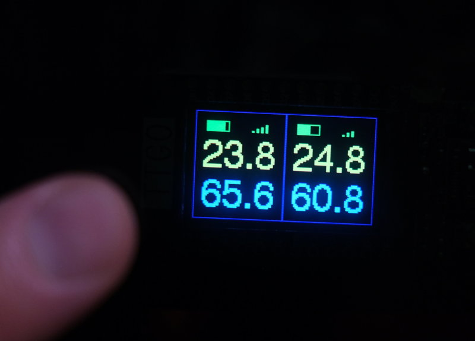

# Use Lilygo T-Display to show ThermoBeacon measurements

T-Display is an inexpensive dev module based on ESP32 LX6 with a 135x240
TFT LCD display. It has built-in radio (WiFi & Bluetooth, incl. BLE) that
can be powered from 3.3 or 5 V, and programmed over USB using Arduino
tools and libraries.

This project turns it into an autonomous temperature and humidity display
that collects data from up to two ThermoBeacon BLE sensors. BLE scanner
is passive, it only listens to the advertisement frames sent by the sensors.
If more than two sensors are present, measurements from the first two, are
displayed, based on the RSSI value (that means, presumably, the two sensos
in the closest proximity to the display module). No configuration should be
necessary.

One of the buttons (GPIO 35) toggles between graphic display of battery
charge and signal strength, and MAC address (last three octets).

Depnedencies: `ArduinoBLE` library and `Bodmer/TFT_eSPI`.

## Homepage and source

Home page is [http://www.average.org/ThermoBeaconDisplay/](http://www.average.org/ThermoBeaconDisplay/)
Get the source from the origin `git://git.average.org/ThermoBeaconDisplay.git`
or from [Github mirror](https://github.com/crosser/ThermoBeaconDisplay).
